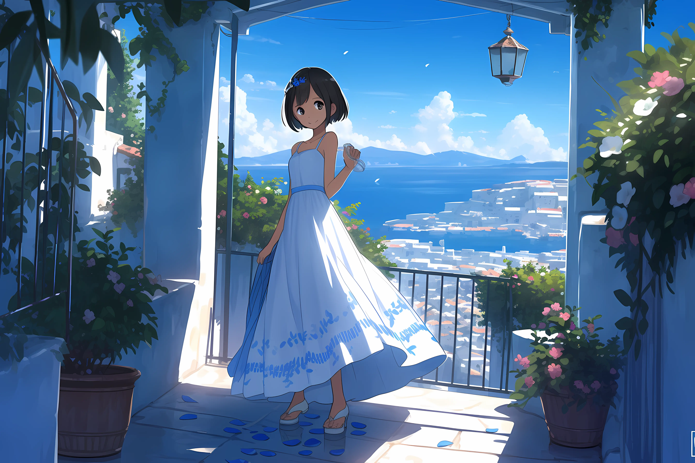
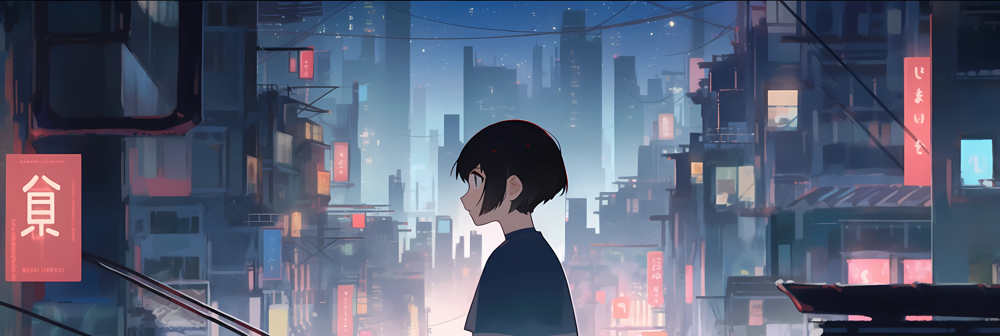
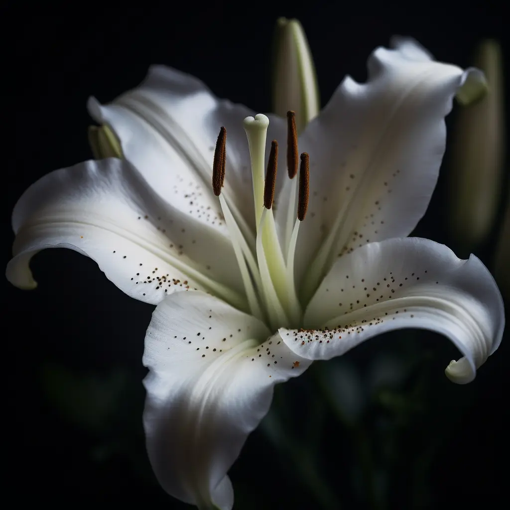
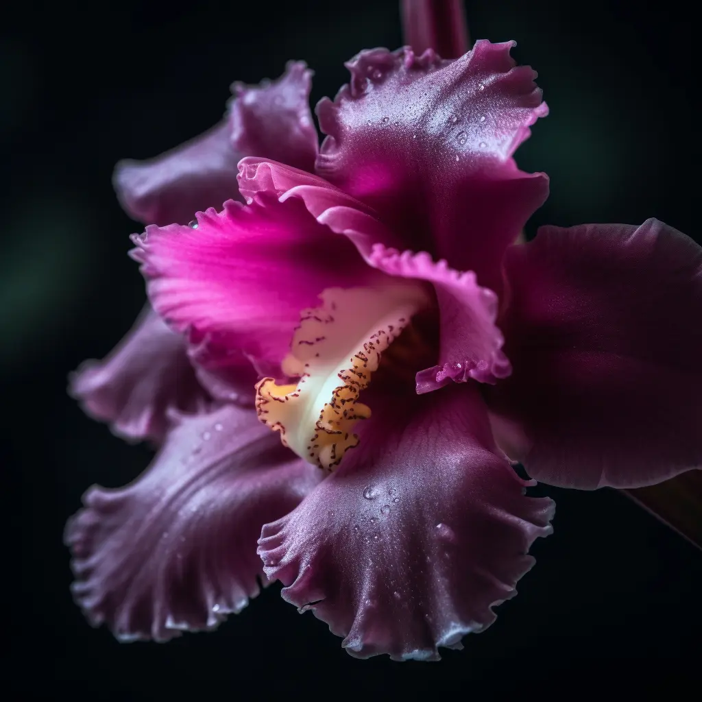
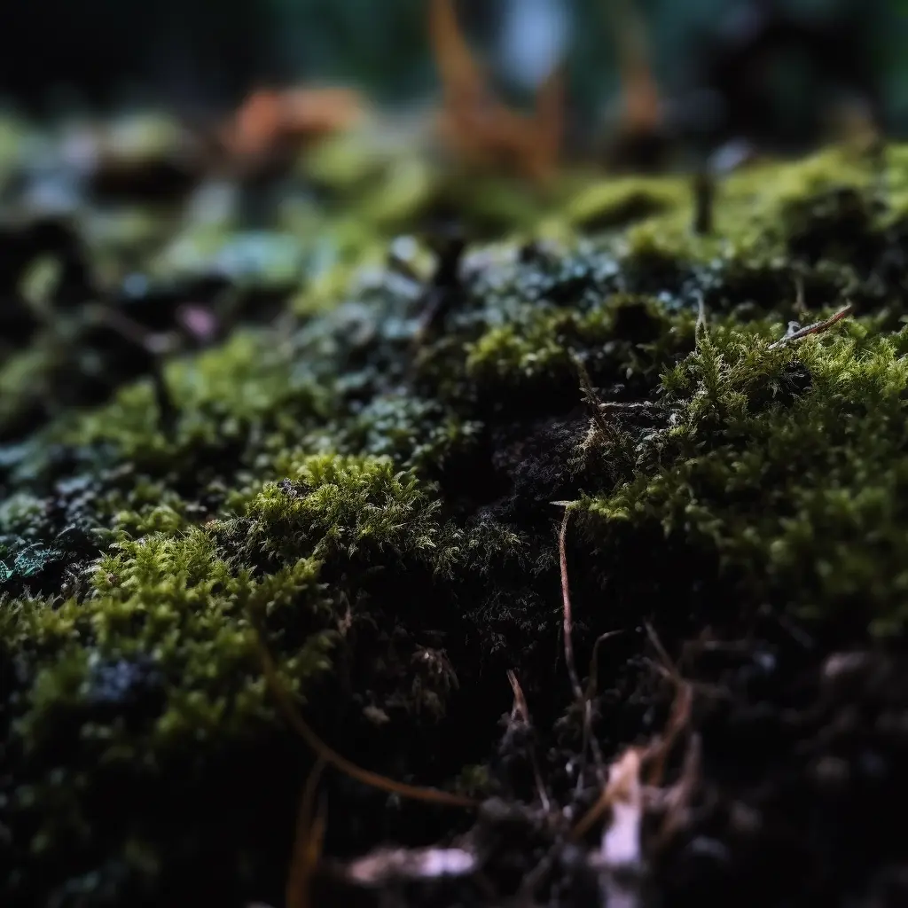

<main>

  

このサンプルのグリッドは4×6で分割しています。左のイラストは左上3×3の領域に配置しており、このテキストは右上1×2の領域に配置しています。

下のイラストは4×3の領域に配置していますが、画像右側のようにページの外側にはみ出すこともできます。

  

このテキストのように、ページの外側に配置することもできます。画像の説明に便利です。

 <!-- grid-page -->

これは見開きページのサンプルです。以下の横長の画像のように、ページをまたいだ配置も実現できます。テキストもこのように2ページにまたがって配置できますが、本によってはノド（ページの綴じ目の部分）にあるテキストが読みにくくなってしまうため注意してください。また、Vivliostyleの組版の制約上、左ページ用と右ページ用に同一の内容を用意する必要があります。詳しい内容はこのページのソースを確認してみてください。

  

このテキストのように、他の領域の上に別の領域を重ねることができます。

グリッドレイアウトは非常に自由度の高いレイアウトを実現することができます。テキストの流し込み（複数領域にまたがる文章）ができないという欠点がありますが、写真やイラスト、短いテキストの組み合わせに向いています。

なお、このサンプルに掲載されているイラストや写真は、全て画像生成AI「Midjourney」を使って生成されたものです。急速に普及しつつある画像生成の技術は、計算機科学に関わるものとして嬉しく思いますが、今後は有効活用のための議論をより活発にする必要があるでしょう。

 <!-- grid-page -->

これは見開きページのサンプルです。以下の横長の画像のように、ページをまたいだ配置も実現できます。テキストもこのように2ページにまたがって配置できますが、本によってはノド（ページの綴じ目の部分）にあるテキストが読みにくくなってしまうため注意してください。また、Vivliostyleの組版の制約上、左ページ用と右ページ用に同一の内容を用意する必要があります。詳しい内容はこのページのソースを確認してみてください。

  

このテキストのように、他の領域の上に別の領域を重ねることができます。

グリッドレイアウトは非常に自由度の高いレイアウトを実現することができます。テキストの流し込み（複数領域にまたがる文章）ができないという欠点がありますが、写真やイラスト、短いテキストの組み合わせに向いています。

なお、このサンプルに掲載されているイラストや写真は、全て画像生成AI「Midjourney」を使って生成されたものです。急速に普及しつつある画像生成の技術は、計算機科学に関わるものとして嬉しく思いますが、今後は有効活用のための議論をより活発にする必要があるでしょう。

 <!-- grid-page -->

<!-- facing-pages -->

  

  

  

  

  

Gridレイアウトによる表現の可能性は無限大です。色々なレイアウトを想像してみてください。

 <!-- grid-page -->

</main>

